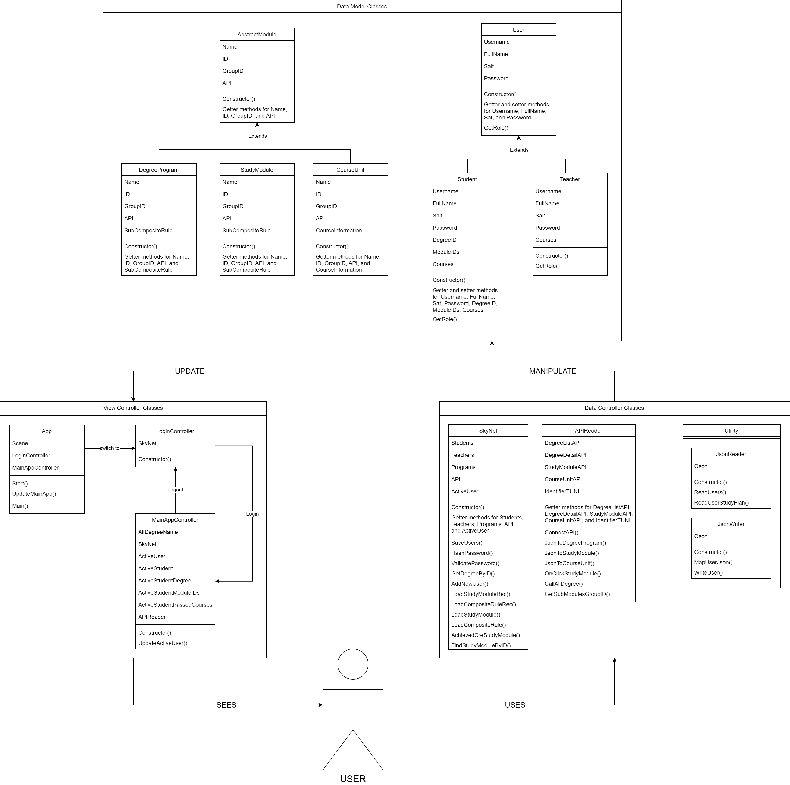
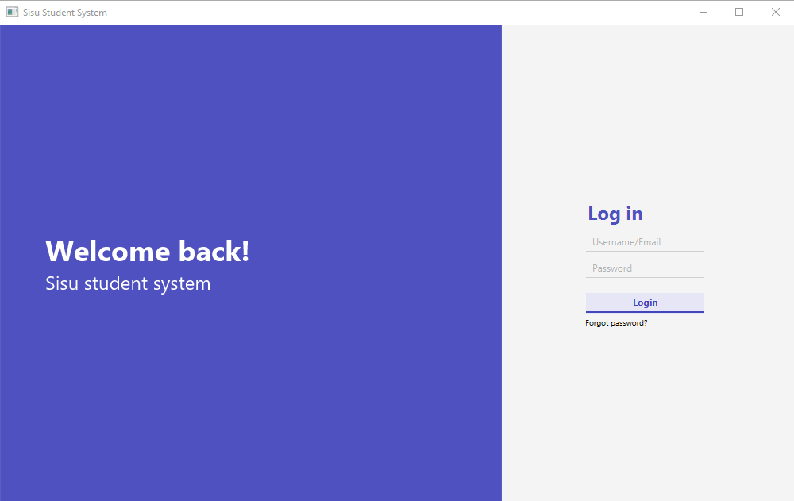

# Programming 3 Project: Sisu Unravel

### **This `README.md` also serves as a documentation for the project. Additional documentation are provided [here](./documentation/). The links in this `README.md` lead to the corresponding files/folders that are mentioned. Because it's more interactive, we recommend you to read through this `README.md` first, and then the provided `PDF` documentation.**

The project's goal is to create an implementation of the Sisu system, using Java, JavaFX library, and SceneBuilder. The program will have a working GUI, as well as functionalities that will be described briefly in this `README.md` and in more detailed in the [provided documentation](./documentation/).

Our team included:

- Cuong Nguyen, cuong.nguyen@tuni.fi, `050358715`. Handle the data manipulation with the `SkyNet` class.
- Khoa Nguyen, khoa.h.nguyen@tuni.fi, `050359141`. Handle the GUI part of the program, using the classes provided by An and Cuong.
- An Nguyen, an.nguyen@tuni.fi, `050359099`. Handle the API data fetching with the `APIReader` class.

Each of our team members are then document their our work and write the necessary tests for the parts that they worked on.

</br>

---

## 1. Program Functionality

Our program has the following functionalities based on the requirements from Plussa.

1. Minimum requirements:
   - The program compiles.
   - The program contains one dialog window (e.g. the initial dialog).
   - The program uses the course provided UI as its main window.
   - The program gets the structures of the degrees from a defined JSON file.
   - The program is able to show the selected study program structure in the main window.
   - A final document that contains:
     - Class responsibilities.
     - Division of labour in the team.
1. Intermediate requirements:
   - A graphical user interface has been fully implemented by the team. The UI is:
     - Procedural - it gets updated based on the data parsed from user and fetched from Sisu's API.
     - Responsive - interactive objects e.g, buttons, has different states to indicate what is being selected.
     - Color and contrast - a dedicated color scheme was chosen for better UX.
     - Minimal - minimal design language, that can help with the program's information hierarchy.
   - The program gets the degree structures from the Sisu API.
   - The program works i.e. the degree shown can be changes and the progress situation of the student’s degree is shown.
   - The program handles errors in file handling.
   - Unit tests have been implemented for the program, using `JUnit Test` for classes and `TestFX` for GUI.
1. Top-grade requirements:
   - Course view. On clicking the mouse cursor on a course card, information about that course is shown.
   - Student settings. Every student's data is stored in JSON files (more on this later). Logged in students can freely update their credentials in the program.
   - Showing the schedule of student progress in respect to the degree structure, i.e, completed credits, average grade, and total credits planned.
   - A dedicated **Help** tab that describes how the program can be used.

</br>

---

## 2. Program structure

Our program follows the [MVC Design Pattern](https://www.geeksforgeeks.org/mvc-design-pattern/), that is, it has **Model Classes** that contain the data for the application, **Controller Classes** that handle events triggered by the user and manipulate the data in response to those events, and **View Classes** that display the data onto the GUI.

### **Model Classes - Database**

The program will have the following **Class Tree** for the database.

1. [AbstractModule](Sisu\src\main\java\fi\tuni\prog3\sisu\system\AbstractModule.java) is the basic study module that contains all the courses and study modules for each specified student. This class includes:

   - [DegreeProgram](Sisu\src\main\java\fi\tuni\prog3\sisu\system\DegreeProgram.java) is the degree of a programme. This class contains information about sub study modules and courses of that degree. This class has the highest level in the class structure.
   - [StudyModule](Sisu\src\main\java\fi\tuni\prog3\sisu\system\StudyModule.java) is the module of courses in the degree programme. Each study module can contain multiple courses, or sub study modules under it. This class is the middle level of the class structure.
   - [CourseUnit](Sisu\src\main\java\fi\tuni\prog3\sisu\system\CourseUnit.java) is the courses inside each study module of a program. This class has the lowest level in the class structure.

2. [User](Sisu\src\main\java\fi\tuni\prog3\sisu\system\User.java) is the user of the Sisu service. They can be students or teachers.

   - [Student](Sisu\src\main\java\fi\tuni\prog3\sisu\system\Student.java) are the students that studying in the degree programs. Every student has:
     - Their current `DegreeProgram`.
     - The `StudyModule` under that degree.
     - `CourseUnit` of courses that they have passed.
   - [Teacher](Sisu\src\main\java\fi\tuni\prog3\sisu\system\Teacher.java) are the teachers of the courses. Every teacher can **(Not implemented in this version)** :
     - Have access to the courses. They can modify the content of each course.
     - Grade the students.

### **Controller Classes - Data Handling**

The data for the application is handled primarily with 2 classes: `SkyNet` (it's a reference!) and `APIReader`. The data is read from JSON files that contains users' data, and the corresponding course data is fetched from the Sisu API.

1. [SkyNet](Sisu\src\main\java\fi\tuni\prog3\sisu\system\SkyNet.java)
   is for handling data stored in JSON files, updating user info, and managing login/logout process.
2. [APIReader](Sisu\src\main\java\fi\tuni\prog3\sisu\system\APIReader.java)
   is for API handling including calling to Kori API and converting that information into the suitable class (`DegreeProgram`, `StudyModule`, or `CourseUnit`). The information of this class is provided in [this documentation](/documentation/An%20Nguyen%20documentation.pdf).
3. Utility classes:

- [JsonReader](Sisu\src\main\java\fi\tuni\prog3\sisu\utility\JsonReader.java)
  that reads user info from JSON files to create User objects, using TypeAdapter to convert data in JSON files to Java objects
- [JsonWriter](Sisu\src\main\java\fi\tuni\prog3\sisu\utility\JsonWriter.java)
  that writes info of `User` objects to `JSON` files, , using `TypeAdapter` to convert data in `JSON` files to `Java Objects`.

### **View Classes - GUI Controllers**

The GUI for the program has 3 classes: an [App](Sisu\src\main\java\fi\tuni\prog3\sisu\App.java)
class, and 2 controller classes: [LoginController](Sisu\src\main\java\fi\tuni\prog3\sisu\LoginController.java)
and [MainAppController](Sisu\src\main\java\fi\tuni\prog3\sisu\MainAppController.java). The 2 controller classes act as a bridge between the GUI and the Controller classes, and call different methods corresponding to the events triggered by the user on the GUI. These methods will then return the correct data, which can be displayed on the GUI view.

1. The `App` class handles the program startup. It loads the necessary scene from the `FXML` files, and creates a new `SkyNet` object to handle data of that use instance.
2. The `LoginController` controls the login scene of the app. It checks for correct user's credentials, alert any errors, and logs the user into the system.
3. The `MainAppController` controls most of the functionalities of the GUI. This class handles the `MainApp` window, and will be explained in details in part **3. GUI** of this document.

### **UML Class Diagram of the Program**

Provided here is a simplified project class structure diagram that shows all the classes listed above, and their relationship with each other.
</br>


_Figure 1: Class structure diagram of the program_

</br>

---

## 3. GUI

The GUI of the program is controlled by the 3 GUI controller classes mentioned above: `App`, `LoginController`, and `MainAppController`. For the GUI, the program will have a `Login` screen that shows at the start.


_Figure 2: The login screen of the program_

Within this window, the user can log into the system and identified them as student, or teacher (`Teacher` **role is not implemented in this version**). The user can also select the option _Forgot password?_ to reset their password (**this functionality is not implemented in this version**).

Upon successfully logged in, the user will be directed to the `MainApp`.

The `MainApp` is the main GUI of the app. On top of the view, user can see the **SISU** logo, their full name with role, and a _Log Out_ button - that obviously, _log you out_ of the system, and back to the `Login` screen. The `MainApp` also has the following main tabs (which can be switched between simply by clicking on them):

### **Homepage**

- Shows the _Full name_ and _Role_ of the active user.
- Shows the study structure of the active user, i.e., the _degree program_, _study modules_, and _courses_. This structure is shown in a `TreeView` format (similar to the actual Sisu page). In the degree structure, users can see their passed courses that are colored green.

### **Courses**

After pressing the _Show all courses_ button, the user can:

- View all of the courses in the degree program of that active user. They can view the information of a course by clicking on them. They can also see which courses they have finished because those are also colored green.
- This tab also shows the progress of the current active user in the degree program: how many credits have they finished, what is their average grade, and how many total credits have they planned in the current program.
- This part of the program can be expand further if needed: when clicked on the course card, every information on that course is fetched from the API. So, if needed, a _"Show course details"_ window can be implemented similar to the actual Sisu.

### **Settings**

There are 2 sub-tabs in this tab: **Update User Information** and **All Degrees**

1. **Update User Information**

- View the active user's information i.e., _Full Name_ and _Current Username_.
- Change the credentials of the active users, i.e., changing username or password. The changes will be updated in the `JSON` data files.

1. **All Degrees**

- The user can view all 269 degree programs in the Sisu API by clicking the _Show all Degrees_ button.
- They can click on any of the shown degrees, and the information from that degree will be fetched from the Sisu API and displayed in a `TreeView` similar to the **Homepage** tab. Again, if any of the courses in these degrees are passed, it will be colored green.

### **Help**

- Explain how one can use the program. Briefly go through the functionalities and elements in the GUI.
- Viewing the documentation of the program by pressing the _View Documentation_ button.

</br>

---

## 4. Navigation

The application has 2 windows: the `Login` window and the `MainApp` window. After running the application, user will land on the `Login` window. They can then

</br>

---

## 5. Testing

The tests include the data handling tests, and UI tests. The data handling tests are written with JUnit Tests. The UI tests are written with TestFX.

1. **JUnit Tests**: these tests include tests for the `JsonWriter` and `SkyNet` classes.

   - [JsonWriter tests](./Sisu/src/test/java/fi/tuni/prog3/sisu/utility/JsonWriterTest.java) testing methods for saving user information - including `username`, `full name`, `password`, and `salt` the password - into a JSON file

   - [SkyNet tests](./Sisu/src/test/java/fi/tuni/prog3/sisu/system/SkyNetTest.java):

     - Test methods for loading user information - `username`, `full name`, `password`, `salt`, `degreeID`. `modules`, `passedCourses` - into a `Student` object
     - Test methods for validating the password which a user typing when login/change-password. A password is hashed by **PBKDF2** applying **HMAC-SHA1** to the input password along with a `salt` value and repeats the process many times to produce a derived key (hashed-password)
     - Test methods for creating a new `User` which includes checking existed `username`, valid `password`, and then saving to a JSON file

   - [APIReader tests](./Sisu/src/test/java/fi/tuni/prog3/sisu/system/APIReaderTest.java): in these tests, the tester looked at the API, and manually took out the information to put into the test for comparison - this is called _"the true"_ information.

     - The `connectAPI()` function is special (when testing) because it was written to throw some error, but the `try - catch` block catches that error. This is why `JUnitTest` can’t `assertThrows` - because the error is already caught. Instead, when `connectAPI()` hits the catch block, it `return null` so `assertNull` is the way to go (and the error will still be printed out in the terminal when testing - even though the tests are pass).
     - For the 3 functions that convert `JSON` to `DegreeProgram`, `StudyModule`, and `CourseUnit`, a specify API was called and took _“the true”_ information, compared it to every entity the made `Object` has.
     - Some getter functions are tested by comparing the gotten results directly to what they should return.
     - `callAllDegrees()` is tested by comparing the total degrees number, and take a random object and compare its name against _“the true”_ name.
     - `getSubModuleGroupId()` and `onClickSubModule()` is tested by comparing _“the true”_ list of `GroupId` against the function generated one.

   - [DegreeProgram tests,](./Sisu/src/test/java/fi/tuni/prog3/sisu/system/DegreeProgramTest.java),
     [StudyModule tests](./Sisu/src/test/java/fi/tuni/prog3/sisu/system/StudyModuleTest.java),
     [CourseUnit tests](./Sisu/src/test/java/fi/tuni/prog3/sisu/system/CourseUnitTest.java),
     [AbstractModule tests](./Sisu/src/test/java/fi/tuni/prog3/sisu/system/AbstractModuleTest.java),
     [AnyRule tests](./Sisu/src/test/java/fi/tuni/prog3/sisu/system/AnyRuleTest.java), and
     [SubCompositeRule tests](./Sisu/src/test/java/fi/tuni/prog3/sisu/system/SubCompositeRuleTest.java):
     these tests mainly verify the getter functions for these classes. The tests created 1-2 test object(s) of the tested class and compare each entity that the object has to the caller function.
     </br>

1. **TestFX Tests**: in the [TestFX tests](Sisu\src\test\java\fi\tuni\prog3\sisu\AppTest.java), the tests simulate a real user's actions, and test all the functionalities of the GUI based on those actions. Please be mindful that, these GUI tests are far from perfect, but should cover the "intended" use case of the program. There are some inconsistency in the data fetched from Sisu's API, so some of the displayed data might be erroneous. Albeit, in most cases, the application should work fine. Following is a run down of the GUI test.
   - Test the login functionalities of the app. A user can log into the app with correct credentials. The app will also notifies the user if they enter an incorrect username/password.
   - Test the main application's interface. Which includes:
     - The **Homepage** tab: test that correct information of the active student is displayed. Also check that the degree program's structure of the student is also presented.
     - The **Courses** tab: test that the student's average grade, completed credits, and total credits planned are correctly visible. Also test that the app can fetch all of the student's courses, and display the information of those courses accordingly.
     - The **Settings** tab: There are 2 sub-tabs in the **Settings** tab, of which will be tested independently.
       - The **Update User Information** tab: test that the user can view their information, including _Full Name_ and _Current Username_. Also test that the user can change their _username_ and _password_. The functionalities of these features are tested accordingly e.g., wrong password confirmation handling, empty fields handling, cancel change handling, update successful handling.
       - The **All Degrees** tab: test that the user can fetch all 269 different degree programs from the Sisu API with the _Show all Degrees_ button. Also test that, when the user clicks on any of the shown degree's button, the details of that degree will be displayed and the user can freely view those data.
     - The **Help** tab: test that the user can press the _View Documentation_ button to view the documentation for the whole application.
   - Lastly, test the **Log Out** functionality of the program by pressing the _Log Out_ button on the top right corner.

</br>

---

## 6. Using and Testing the Application

This application is built using the [Maven](https://maven.apache.org/) project management. We used NetBeans and VSCode as our primary coding IDE. So commands from `Maven` can be used for compiling and testing.

### **Compile and Run the Project**

The project can be compiled by:

1. Opening the the folders as a NetBeans project, then compile and run in NetBeans.
2. In the `./Sisu/` directory of the project, run the following command

```
$ mvn javafx:run
```

The project will then be compiled and run as a `JAR`-executable, and will automatically start. You can then start using the app as any other normal desktop app!

### **Testing the Project**

The project can be tested by running the following command in the `./Sisu/` directory of the project:

```
$ mvn test
```

The result of the tests will be printed in the terminal, and the test results will be displayed by `Maven`'s testing framework.

Be mindful that, since the GUI testing tests every functionalities of the program, so that the username and password of the last active user (in the tests, this would be the An Nguyen user) will be changed in the test. To revert this, just run this command in the `./Sisu/` directory:

```
$ git restore .\src\main\resources\jsons\users.json
```

and the users' credentials will be restore to original! The tests can then be run again.

</br>

---

## 7. Finalization

This was a very challenging project for all of us. We managed to
